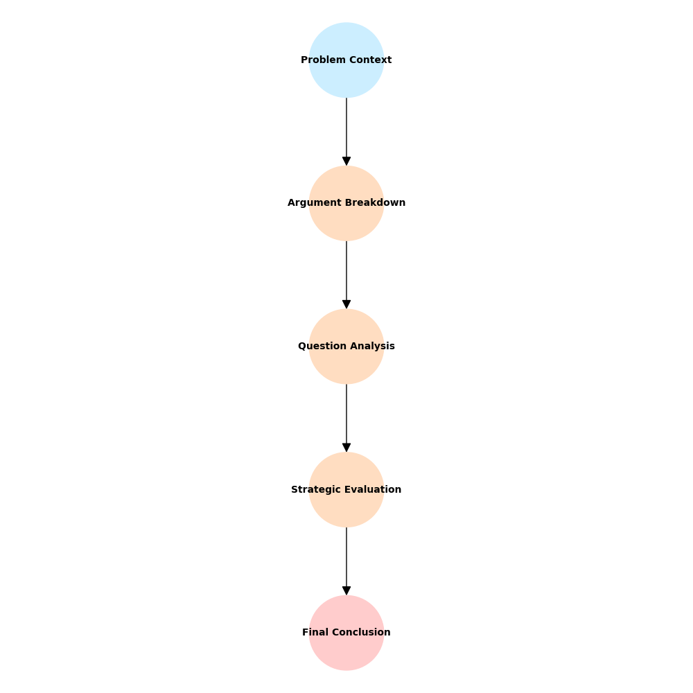
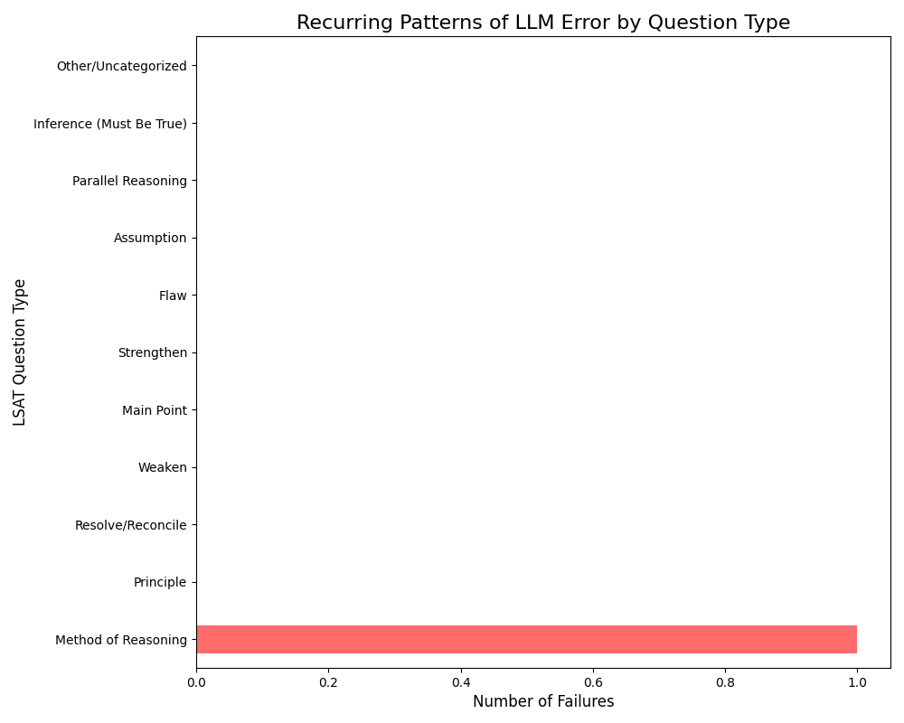

# Mapping Logical and Cognitive Errors in LLMs

This project is a Python framework to analyze the logical reasoning capabilities of Large Language Models (LLMs) on LSAT (Law School Admission Test) problems.

It feeds problems to an LLM (like Google's Gemini), parses the model's step-by-step reasoning, and generates "reasoning maps" to visualize the logical chain. Finally, it runs a batch analysis to find and categorize recurring patterns of error.

## How it Works

This framework operates in three main stages:

### 1. Data Collection (`main.py`):
- Loads 50+ problems from the `tasksource/lsat-lr` dataset and queries the Gemini API for a step-by-step analysis of each.

### 2. Mapping (`reasoning_parser.py`):
- Parses the LLM's text response. It then builds a `networkx` graph to create a "reasoning map" (e.g., `Context` -> `Argument Breakdown` -> `Final Conclusion`) and saves it as a .png.

### 3. Analysis (`analyze_results.py`):
- Reads the `results.csv` file, checks the LLM's answer against the ground truth, and categorizes each question by type (e.g., "Flaw," "Assumption") to find and chart recurring error patterns. The full list of categories can be seen in the `categorize_question` function.

## Tech Stack
The project relies on the following key technologies and libraries:
- **Language Model (LLM)**: Google Gemini API (`gemini-2.5-flash-preview-09-2025`)
- **Core Language**: Python 3
- **Data Handling**: pandas, HuggingFace datasets (for LSAT data)
- **Networking**: httpx (asynchronous API calls)
- **Graph/Visualization**: networkx, matplotlib (for Reasoning Maps and Bar Charts)
- **Utilities**: python-dotenv, asyncio, re (for robust text parsing)

## Setup

### 1. Clone the Repository:
```bash
git clone [your-repo-url]
cd ReasoningMaps-LLM
```

### 2. Install Dependencies:
- Make sure you have all the required Python libraries.
```bash
pip install -r requirements.txt
```

### 3. Create Environment File:
- This project requires a Google Gemini API key.
- Create a file named .env in the main folder.
- Add your API key to it like this:
```bash
LLM_KEY="YOUR_API_KEY"
```

## Usage

The analysis is a two-step process:

### 1. Data Collection and Mapping:
- Run `main.py` to fetch the problems, query the LLM, and generate the maps. This will analyze 50 problems and may take 5-6 minutes to complete due to API rate limits.
```bash
python main.py
```
- After running `main.py`, the script will produce two outputs:
    1. results.csv: A spreadsheet containing the detailed results for each problem.
    2. reasoning_maps/: A folder containing 50 visualization maps, one for each problem.

### 2. Analysis:
- Run `analyze_results.py` to read the `results.csv` file and print a summary report of the LLM's performance and error patterns.
```bash
python analyze_results.py
```

## Example Output

Running `python analyze_results.py` will produce a report like this:

### Analysis Report
```bash
--- Analyzing Results from results.csv ---

--- API & Parsing Health ---
Total Problems Processed: 50
API Errors (e.g., 429 Limit): 1

--- Overall Performance (on successful requests) ---
Total Successful Requests: 49
Correct Answers: 48
Incorrect Answers: 1
LLM Accuracy: 97.96%

--- Recurring Patterns of Error ---
The LLM struggled most with the following question types:
  - Method of Reasoning 
    (Failed 1 time(s))
```

### Reasoning Map (Example of a Failure)

The report shows one failure. By checking results.csv for the failed problem, we can find its corresponding map in the reasoning_maps/ folder. This map visualizes the exact logical chain where the LLM failed (note the red "Final Conclusion" node).



### Error Pattern Chart

The script also generates a bar chart showing the error counts for all tested categories, providing a clear picture of the LLM's strengths and weaknesses.



## Acknowledgments

- **Data Source**: The `tasksource/lsat-lr` dataset from Hugging Face for providing a robust benchmark of logical reasoning problems.
- **LLM API Service**: The Google Gemini API for providing a high-performance, accessible service for LLM querying.

## License

This project is licensed under the MIT License.

See the LICENSE file for details.